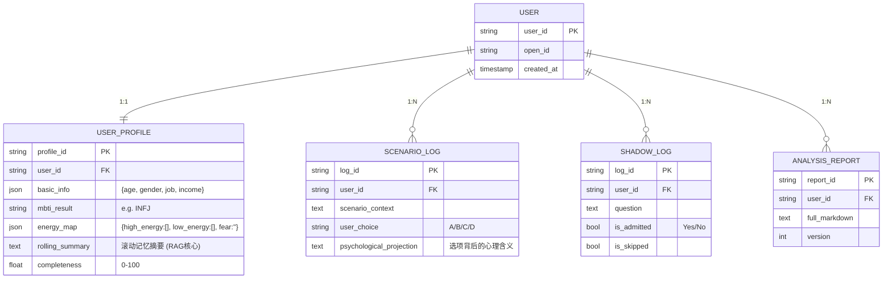

# Technical Architecture Document: AI Mirror

## 1. Architecture design

本系统采用前后端分离架构。前端基于 React 构建沉浸式交互体验，后端采用 Python FastAPI 处理复杂的业务逻辑、记忆管理和 LLM 编排，数据库使用 Supabase (PostgreSQL) 存储结构化数据。

```mermaid
graph TD
  A[用户浏览器] --> B[React 前端应用]
  B --> C[Python FastAPI 后端服务]
  C --> D[Supabase 数据库 (PostgreSQL)]
  C --> E[Google Gemini API]
  
  subgraph "前端层"
      B
  end

  subgraph "应用服务层 (Backend)"
      C
  end

  subgraph "数据与基础设施层"
      D
  end

  subgraph "外部模型服务"
      E
  end
```

## 2. Technology Description

*   **Frontend**: React@18 + TailwindCSS@3 + Vite
    *   交互库: Framer Motion (用于粒子球、卡片滑动动画), React-Markdown (渲染报告).
    *   初始化工具: `vite-init`
*   **Backend**: Python 3.10+ + FastAPI
    *   ORM: SQLModel (Pydantic + SQLAlchemy) - 用于定义符合 ER 图的数据模型.
    *   AI SDK: `google-generativeai` (Gemini SDK).
*   **Database**: Supabase (PostgreSQL)
    *   使用 FastAPI 直接连接 Supabase 提供的 Postgres 连接串，而非使用 Supabase JS SDK (因为后端逻辑较重).

## 3. Route definitions

| Route | Purpose |
|-------|---------|
| `/` | 引导页 (Onboarding)，包含基础信息录入和 MBTI 初始化。 |
| `/chat` | 核心聊天访谈页，承载对话流、标签云和嵌入式场景。 |
| `/assessment` | 深度测试页，用于阴影探索 (Shadow Work) 的卡片式交互。 |
| `/report` | 报告展示页，显示分析结果并进入顾问模式。 |

## 4. API definitions

### 4.1 Core API (Backend Endpoints)

**Chat Interaction**
```
POST /api/chat/send
```
*   **Request**: `{ "user_id": "string", "message": "string" }`
*   **Response**: `{ "reply": "string", "state": "thinking|generating_scenario", "payload": { ... } }`
*   **Description**: 发送用户消息，后端处理记忆窗口、调用 Gemini，并返回回复或触发特殊交互（如场景题）。

**Scenario Generation**
```
POST /api/scenarios/generate
```
*   **Request**: `{ "user_id": "string", "context": "string" }`
*   **Response**: `{ "scenario_id": "string", "question": "string", "options": [...] }`
*   **Description**: 基于用户画像生成职业相关的场景模拟题。

**Shadow Work**
```
GET /api/shadow/next_question
POST /api/shadow/answer
```
*   **Description**: 获取下一个阴影探索问题 / 提交用户的“承认/否认”选择。

**Report Generation**
```
POST /api/report/generate
```
*   **Request**: `{ "user_id": "string" }`
*   **Response**: `{ "report_markdown": "string", "report_id": "string" }`
*   **Description**: 触发分步生成链 (Chain of Tasks)，生成长文本心理分析报告。

## 5. Server architecture diagram

后端服务采用典型的 MVC (Controller-Service-Repository) 分层架构，以确保逻辑清晰和可维护性。

```mermaid
graph TD
  Request[Client Request] --> Router[API Router / Controllers]
  Router --> Service[Business Logic Services]
  
  subgraph "Service Layer"
    Service --> ChatService[Chat & Memory Service]
    Service --> ProfileService[Profile & Analysis Service]
    Service --> ReportService[Report Generation Service]
  end

  ChatService --> LLM[LLM Client (Gemini)]
  ReportService --> LLM
  
  ChatService --> Repo[Repository Layer]
  ProfileService --> Repo
  Repo --> DB[(Supabase PostgreSQL)]
```

## 6. Data model

### 6.1 Data model definition



### 6.2 Data Definition Language

```sql
-- Enable UUID extension
CREATE EXTENSION IF NOT EXISTS "uuid-ossp";

-- Users Table
CREATE TABLE users (
    user_id UUID PRIMARY KEY DEFAULT uuid_generate_v4(),
    open_id VARCHAR(255) UNIQUE,
    created_at TIMESTAMP WITH TIME ZONE DEFAULT NOW()
);

-- User Profile Table
CREATE TABLE user_profiles (
    profile_id UUID PRIMARY KEY DEFAULT uuid_generate_v4(),
    user_id UUID REFERENCES users(user_id) NOT NULL UNIQUE,
    basic_info JSONB DEFAULT '{}',
    mbti_result VARCHAR(10),
    energy_map JSONB DEFAULT '{}',
    rolling_summary TEXT,
    completeness FLOAT DEFAULT 0.0
);

-- Scenario Logs Table
CREATE TABLE scenario_logs (
    log_id UUID PRIMARY KEY DEFAULT uuid_generate_v4(),
    user_id UUID REFERENCES users(user_id) NOT NULL,
    scenario_context TEXT,
    user_choice VARCHAR(10),
    psychological_projection TEXT,
    created_at TIMESTAMP WITH TIME ZONE DEFAULT NOW()
);

-- Shadow Logs Table
CREATE TABLE shadow_logs (
    log_id UUID PRIMARY KEY DEFAULT uuid_generate_v4(),
    user_id UUID REFERENCES users(user_id) NOT NULL,
    question TEXT,
    is_admitted BOOLEAN,
    is_skipped BOOLEAN DEFAULT FALSE,
    created_at TIMESTAMP WITH TIME ZONE DEFAULT NOW()
);

-- Analysis Reports Table
CREATE TABLE analysis_reports (
    report_id UUID PRIMARY KEY DEFAULT uuid_generate_v4(),
    user_id UUID REFERENCES users(user_id) NOT NULL,
    full_markdown TEXT,
    version INTEGER DEFAULT 1,
    created_at TIMESTAMP WITH TIME ZONE DEFAULT NOW()
);
```
